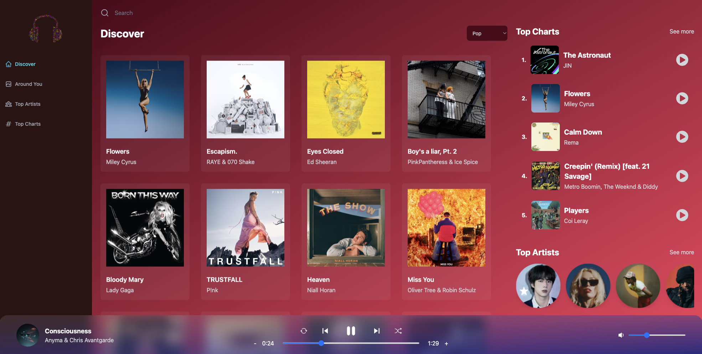

# TuneLab 🎵 🎧

TuneLab is a web application that allows you to discover top artists, top charts, and top artists and charts, search for and listen to your favourite music. The app utilizes ShazamCore API, React Redux, Tailwind, and Vite, and is deployed on Netlify.

The functionality of the TuneLab web application is made possible by the use of the [ShazamCore Rapid API](https://rapidapi.com/tipsters/api/shazam-core), which provides access to a vast music database. The app utilizes the [Geo Ipify API](https://geo.ipify.org/) to determine the user's location and provide customized content based on their location.

## Getting Started

To run TuneLab on your local environment, you will need to obtain a ShazamCore and Geo Ipify API keys, which you can obtain but visiting the above links to their websites.

Shazam Core requires subscription, whereas Geo Ipify has free options.

Once you have obtained your API key, you will need to create a .env file in the root directory of the project and add the line indicated below or just copy the code you can find in my .env.example file:

```
VITE_SHAZAM_CORE_RAPID_API_KEY=<your_shazam_core_api_key>
VITE_GEO_API_KEY=<your_geo_ipify_api_key>
```

You can then install the dependencies and start the application by running the following commands:

```
# install dependencies
npm install

# start the application
npm run dev
```

## Features

TuneLab offers the following features:

- (Most Important) Search for and listen to you favourite music
- Discover top artists and top charts
- Access the artists related songs
- Access the song lyrics
- Discover top artists based on the user's location
- Polished UI and fully responsive design

## Discover Page Screenshot & Demo



Below link will take you to the app demo:

[TuneLab Demo](https://drive.google.com/file/d/11vnV9eSSdb0Wcx_xukyasOZtQeCtobKC/view?usp=sharing)

## Technologies Used

- [ShazamCore Rapid API](https://rapidapi.com/tipsters/api/shazam-core)
- [Geo Ipify API](https://geo.ipify.org/)
- [React Redux](https://react-redux.js.org/)
- [Tailwind](https://tailwindcss.com/)
- [Vite](https://vitejs.dev/) (it has the fastest build times 🤯, you should try it out!)
- Deployed via Netlify (unfortunately, I can't share the link due to the pesky subscription fee for Shazam Core API)

## Acknowledgements

This App was inspired by [JavaScript Mastery](https://www.youtube.com/@javascriptmastery), with my personal touch added.
